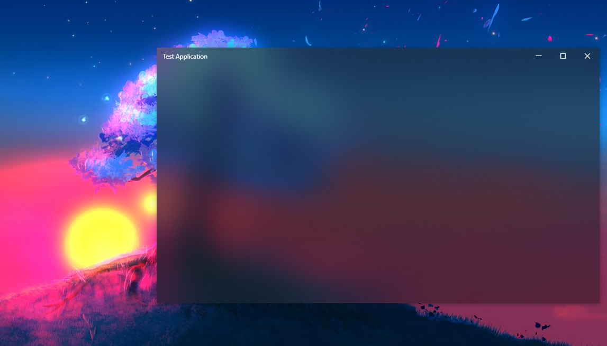

# electron-acrylic-window

 
  
[](https://travis-ci.com/seo-rii/electron-acrylic-window)
[](https://david-dm.org/seo-rii/electron-acrylic-window) 
[](https://badge.fury.io/js/electron-acrylic-window)  

Simply add vibrancy effect to Electron application on Windows.

Works only on Windows 10. If os is not Windows 10, it will call original function.  

Inspired from ```electron-vibrancy```.

## Download

You should install Visual studio or Visual C++ build tools before install this.

```shell script
npm i electron-acrylic-window --save
```

## Screenshots


## Usage

### `BrowserWindow` - Wrapper class for ```BrowserWindow```.  

```js
win = new BrowserWindow({
    ...,
    frame: false,
    vibrancy: 'dark' // 'dark', 'light', 'appearance-based', or hex colour code with alpha '#ffff0066'
});
```

- If OS is not Windows 10, it works perfectly the same.  

- If OS is Windows 10, it overrides construtor option and ```setVibrancy``` method to work properly on Windows 10.

### `setVibrancy`

```javascript
setVibrancy(win, op = null);
```

- Enables Vibrancy to window.
    - There is no return value. If it fails to set vibrancy, it throws error.  
```win``` should be frameLess, and transparent.  
    - This function will call ```win.setVibrancy(op)``` if os is not Windows 10.  
On Windows 10, op should be String or Object.
 * String
    op should be 'light', 'dark', 'appearance-based' or a hex colour code with alpha.  
    If not, it'll be set up as 'appearance-based'.
 * Object
    ```javascript
    op = {
       theme: String ( = 'appearance-based'),
       effect: String ( = 'acrylic'),
       useCustomWindowRefreshMethod: Boolean ( = true),
       maximumRefreshRate: Number ( = 60),
       disableOnBlur: Boolean ( = true)
    }   
   ```
   * theme  
        theme sets color of acrylic effect
        theme should be 'light', 'dark', 'appearance-based' or a hex colour code with alpha.
        If not, it'll be set up as 'appearance-based'.
   * effect  
        effect sets method of Acrylic blur.
        effect should be 'acrylic' or 'blur'.  
        **Setting this option to acrylic may cause performance degradation.**  
        **If the version of the window is RS3 or lower, the 'blur' is forced.**
   * useCustomWindowRefreshMethod  
        Use custom window resize/move handler for performance.
        Special thanks to @djsweet and @xanderfrangos.  
        **This is experimental option. It can cause unintentional error.**
   * maximumRefreshRate  
        Maximum value to refresh application screen in second.  
   * disableOnBlur   
        If true, acrylic effect will be disabled when window blurred.
    

- **Errors**
    - WINDOW_NOT_GIVEN  
        - Error that occurs when ```win``` parameter is not passed.
    - NOT_VALID_WINDOW   
        - Error that occurs when ```win``` parameter is not valid Electron window.
    - FAIL_LOAD_DLL  
        - Error that occurs when fails to load SetWindowCompositionAttribute from user32.dll
    - UNKNOWN  
        - Unknown error.

## Demo

Clone this repository;
```bash
git clone https://github.com/Seo-Rii/electron-acrylic-window.git
```

Install dependencies;
```bash
npm install
```

Run the test application;
```bash
npm run test
```
